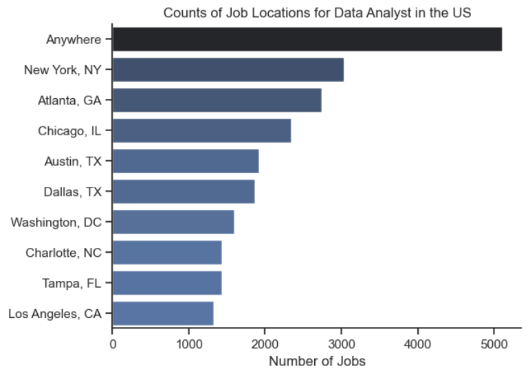
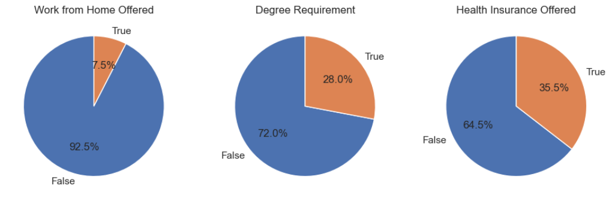
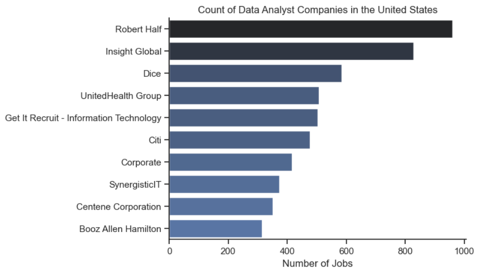
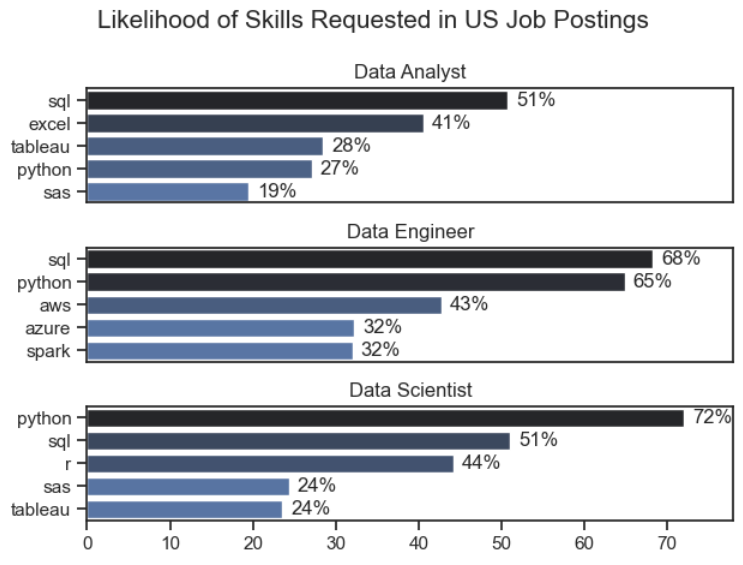
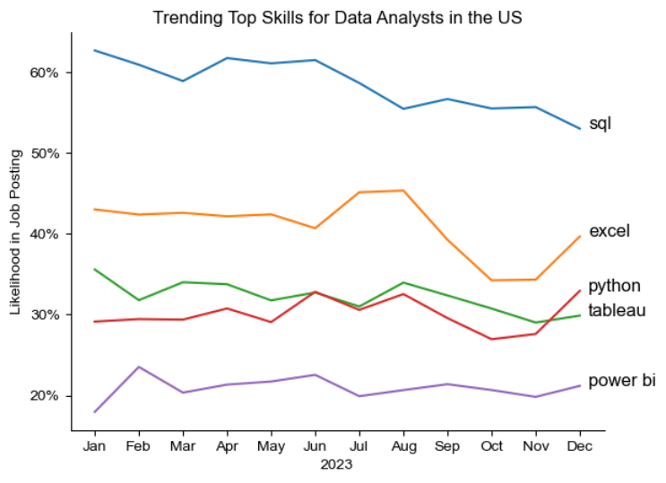
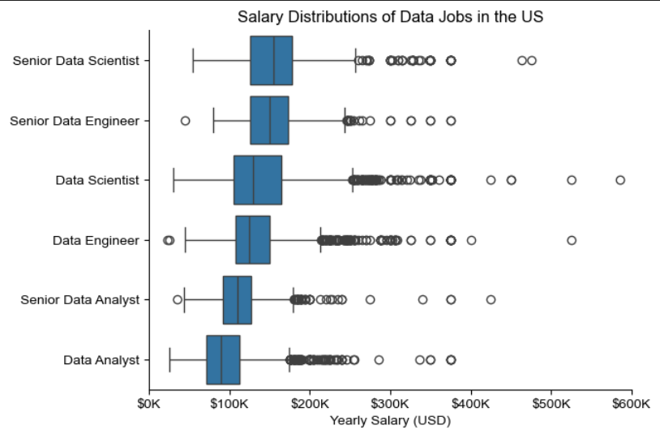
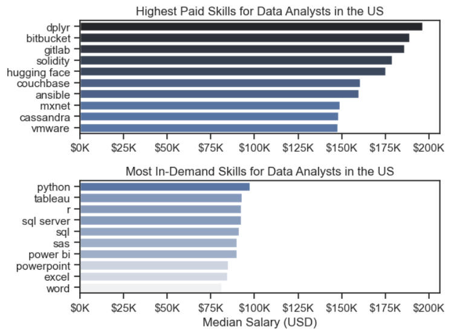
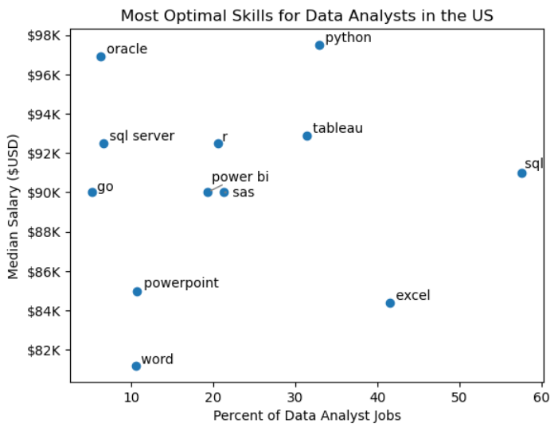
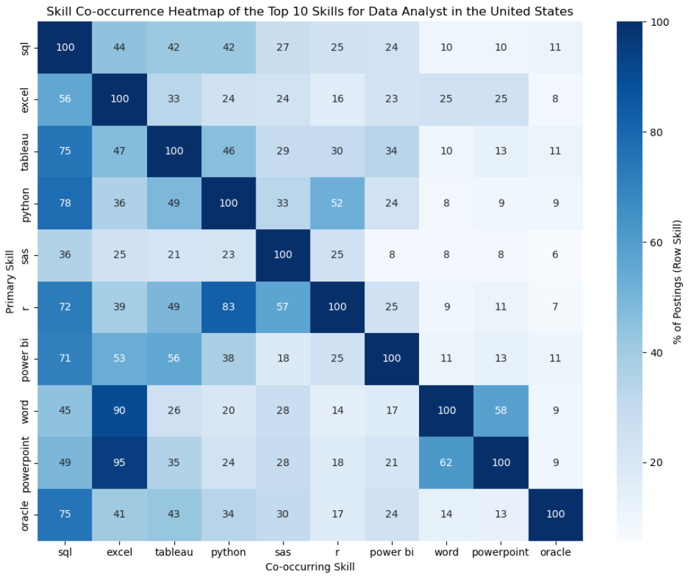

# Overview
This python project was created to analyze Data Analyst jobs in the United State market. Each notebook focuses different aspects of the job market, such as in-demand skills, salaries, trends, companies, and locations. 
This projects analysis was inspired by Luke Barousse's Python course on [Youtube](https://www.youtube.com/watch?v=wUSDVGivd-8), with an additional self-designed question that analyzes the co-occurrence of different skills ([Skill Co-occurence](files/Skill_Cooccurrence.ipynb)).

# The Dataset
The dataset is the same ussed throughout Luke's course, [data set](https://huggingface.co/datasets/lukebarousse/data_jobs) and uses the following columns:
- job_title_short
- job_title
- job_location
- job_via
- job_schedule_type
- job_work from home
- search_location
- job_posted_date
- job_no_degree_mention
- job_health_insurance
- job_country
- salary_rate
- salary_year_avg
- salary_hour_avg
- company_name
- job_skills
- job_type_skills

# Tools Used
- VS Code
    - Jupyter notebooks
    - Anaconda
    - Python Libraries
        - ast
        - pandas
        - seaborn
        - matplotlib
- GitHub

# Data Setup 
- Begun with installing python and anaconda onto my desktop
- Once successfully installed boot up the anaconda Prompt window
    - create an environment
    ```
    conda create -n envname python=3.11
    ```
    - active the environment
    ```
    conda activate envname
    ```
- Once the environment is created, open the project folder in VS Code, enter ctrl+shift+p and type reload window, just in case
- After the window is reloaded use ctrl+shift+p and enter python select interpreter, this will be the kernel used in the jupyter notebooks
    - **Note:** Make sure all required packages are installed on the projects environment 
    ```
    conda install ipykernel pandas matplotlib seaborn
    ```
# Data Prep and CLeaning 
## Import the necessary libraries
    - **Note:** ast import is to evaluate Python expressions from strings into a real Python list
```
import ast
import pandas as pd
import seaborn as sns
from datasets import load_dataset
import matplotlib.pyplot as plt
```
- Load the dataset from [Hugging Face](https://huggingface.co/datasets/lukebarousse/data_jobs)
    - Hugging Face datasets are split into parts, only'train' is used
    - Convert the dataset into a pandas DataFrame 
```
dataset = load_dataset('lukebarousse/data_jobs')
df = dataset['train'].to_pandas()
```
## Data cleanup
    - Convert the job_posted_date column from a string to a datetime object
    - Convert the job_skills column that is storing its values as strings into a Python list, allows for the use of the explode() function
        - Lambda expression to convert into the list
        - pd.notna(x) to ensure it runs on non-missing values to avoid errors
```
df['job_posted_date'] = pd.to_datetime(df['job_posted_date'])
df['job_skills'] = df['job_skills'].apply(lambda x: ast.literal_eval(x) if pd.notna(x) else x)
```
- **Note:** This code is used at the beginning of each jupyter notebook before starting the analysis

## Filtering
- Filter for job postings in the United States, and for some analysis filter for Data Analysis jobs
```
df_DA_US = df[(df['job_country'] == 'United States') & (df['job_title_short'] == 'Data Analyst')]
```
# Analysis
1. [Intro](files/Intro.ipynb)
- **Purpose:** Provide an overview of the dataset and prepare for analysis. This was to get familiarized with using Python and beginning the project.
- **Techniques Used:**
    - Filter the table for Data Analyst roles in the United States and get the top 10 results from counting the job posting location
    - Apply a seaborn bar plot to visualize the count of job postings based on the filter
    
    - Use a dictionary{} to assign required columns proper names
    - A for loop iterates over the dictionary to create a pie chart based on value_counts() of each required column
    
    - Get the top 10 company name postings and create a horizontal bar plot
    
- **Interpretation:**
    - The majority of job listings in the United States for Data Analyst allow for remote work with the companies in top cities face more competition in recruiting an analyst
    - Within the United States most of the job offerings do not offer work from home (92.5%), do not require a degree (72.0%), and do not offer health insurance (64.5%)
        - Job seekers prioritizing remote work will have a harder time
        - The low degree requirements would suggest that most job posting focus based on skill based hiring
        - With health insurance not being offered could suggest either omission in posting or weaker insurance coverage
    - Robert Half posted the most amount of job postings, with other large corporations. Based on the data the larger amount of job postings come from large consulting and healthcare companies.

2. [What are the most demanded skills for the top 3 most popular data roles?](files/Skill_Demand.ipynb)
- **Purpose:** Identify which skills appear most frequently in job postings
- **Techniques:** 
    - Explode the job_skills column into individual rows
    - Grouped by skill and counted postings
    - Get Top 3 unique job_title_short and set to a list
    - Converted counts to percentages for comparability
    
- **Interpretation:** 
    - Skill requirements vary by each roles, with Analysts focusing on BI tools, Engineers with cloud and big data, and Scientists on programming and statistical languages
        - SQL dominates throughout each role
        - Python remains strong throughout as well, however is in less demand for Data Analyst's
        - The data engineer role is accompanied by cloud based skills (AWS, Azure, and Spark)
3. [How are in-demand skills trending for Data Analysts?](files/Skill_Trend.ipynb)
- **Purpose:** Analyze how in-demand each skill is per month for Data Analyst in the United States
- **Techniques:** 
        - Grouped postings by month and skill
        - Change the months from a number value to short form (ex. 1 -> Jan)
        - Normalized counts into percentages
        - Line plot with annotated labels
    
- **Interpretation:** 
    - SQL remains the most sought out skill for Data Analysts in 2023, however does appear to experience a steady decline in the end of the year
    - Excel experienced fluctuations in end of the second quarter to the third quarter but is steadily rising
    - Python, Tableau, and Power BI are somewhat steady throughout the year and are showing upward trends at the end of the year.
        - Power BI was least demand skill and therefore showed the least flucuations compared to Python and Tableau
4. [a) How well do jobs and skills pay for Data Analysts?](files/Salary_Analysis.ipynb)
- **Purpose:** Explore salary distributions across top data job titles
- **Techniques:** 
    - Get the Top 6 job titles
    - Group job title and salary to calculate the median annual salary
    - Box plot for visualization and format salary numbers
    
- **Interpretation:**
    - The median salary increases as roles become more senior or technically advanced
        - Senior Data Scientist and Data Engineers earn the most, with Data Analyst falling on the lower end
        - Senior Data Scientist and Data Scientist roles show a considerable amount of outliers, with Data Analyst being the most consistent
    - The data demonstrates clear career progression within data based jobs
4. [b) What are the Highest Paid & Most In-Demanded Skills?](files/Salary_Analysis.ipynb)
- **Purpose:** Explore salary distribution between the highest paid skills Vs. most in-demand skills
- **Techniques:** 
    - Filter for Data Analyst and United States
    - Drop NaN values
    - Grouped job title and salary to aggregate count and median
        - Sort by median in descending order
        - Did another groupby and sorted values by count, then re-order by median
    - Box plot for comparing values
    
- **Interpretation:**
    - Advanced technical skills (dplyr, bitbucket, gitlab, etc.) have higher salaries
        - Thereby suggesting knowing more advanced technical skills can lead to a higher salary. However, it is important to note that these skills had the lowest count with the highest salaries suggesting job searching will be more difficult
    - The bottom graph details the most commonly sought out skills for Data Analysts in the US, this graph demonstrates the importance to have the core skills for a higher chance of employability
    - Thereby, Data Analysts looking for entry level should have a strong understanding of the core skills, while Data Analysts aiming to expand their career should consider developing a more diverse skill set 
5. [What are the most optimal skills to learn for Data Analysts?](files/Optimal_Skills.ipynb)
- **Purpose:** Determine the "sweet spot" for skills that both in demand and well-paid
- **Technique:** 
    - Filter and explode job skills
    - Calculate median salary and count per skill
    - Calculate skill prevalence %
    - Create a scatter plot to visualize
    - Use adjust_text() to label points clearly
    
- **Interpretation:**
    - Skills such as SQL and Excel are in high demand, however fall to the mid-to-lower salary range
    - Python has a high demand for jobs accompanied by a high salary
        - Oracle also has a high median salary, however presents itself in less than 10% of the job postings. This can suggest some job postings value specialized database skills. 
    - Tableau appears to be the better BI tool over Power BI as it has a higher median salary and is in a higher percent of job postings
    - To maximize career opportunities, candidates should aim for having a strong foundation in SQL and Excel with the addition of skills such as Python, Tableau, and Oracle
6. [Which skill have the most co-occurrence in job postings?](files/Skill_Cooccurrence.ipynb)
- **Purpose:** Analyze skill combinations instead of individual skill
- **Techniques:** 
    - Add a job_id column before exploding skills
    - Use pd.crosstab() to build a matrix
    - Transpose the matrix to calculate co-occurrence counts with matrix multiplication
    - Normalize to percentages
    - Visualized with a heat map
    
- **Interpretation:**
    - SQL is a dominating skill, with co-occurrence in 78% of Python listing, 75% of Oracle listings, and 72% of R listings, 75% of Tableau listings, and 71% of Power BI listings
        - This tells us that SQL is a foundational skill for data analytics and is often paired with programming languages, databases, and BI tools
        - However, Python is only mention in 42% of SQL postings, suggesting Python is used for a wider variety of roles, whereas SQL is more narrowly focused but is still essential
    - Excel has a strong co-occurrence when job postings list Powerpoint or Word has a primary, suggesting that data cleaning is highly likely. However, when Excel is listed as the primary skill, Powerpoint and Word don't have strong co-occurrences. This suggests these position are less likely to require communication insights via presentations or reports
    - Tableau is commonly co-occurring with programming/databases job postings (~42%-49%). Tableau is also paired in 56% of Power BI listings meaning that it is a fairly sought out skill when paired with programming languages and other BI tools
        - Power BI is less co-occurring with programming/databases listings (~24%-25%), and is paired with Tableau 34% of the time, making it a less desired BI tool
    - R as a primary skill has Python co-occurring in 83% of listings and 72% of the time in SQL listings, meaning these postings may focus more on statistical analysis and modeling
