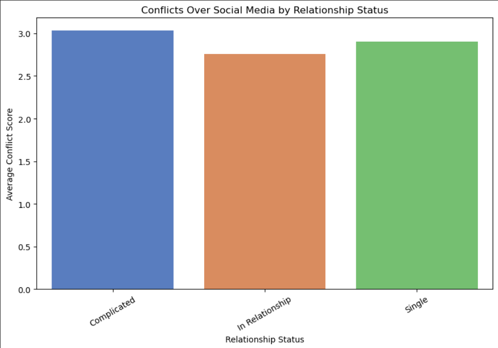
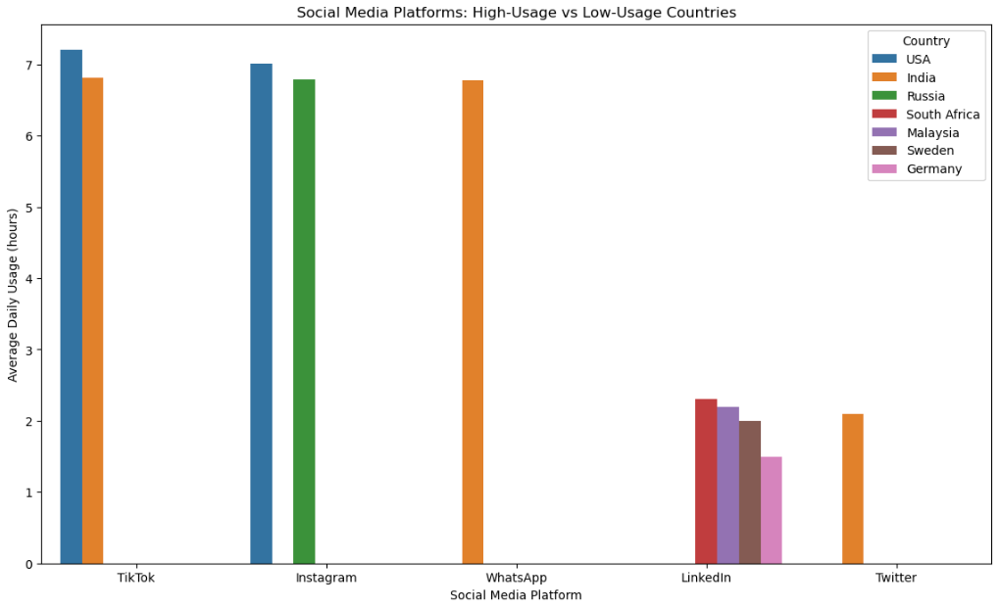

# Social Media Usage
## Overview
This project analyzes a dataset of 705 students, varying in different academic levels and age from multiple countries to explore how social media usage affects students academic performance, sleep, mental health, and social relationships. 

The goal is to answer real-world business questions by turning survey data into insights using Python based analysis and visualizations.

## The Dataset
I retrieved the dataset through [Kaggle](https://www.kaggle.com/datasets/adilshamim8/social-media-addiction-vs-relationships):
The dataset includes:
- Student_ID
- Age
- Gender
- Academic_Level
- Country
- Avg_Daily_Usage_Hours
- Most_Used_Platform
- Affects_Academic_Performance
- Sleep_Hours_Per_Night
- Mental_Health_Score
- Relationship_Status
- Conflicts_Over_Social_Media
- Addicted_Score

## Tools
- VS Code
    - Jupyter Notebooks (*.ipynb)
- Anaconda
- GitHub
- Python
    - Libraries
        - ast
        - pandas
        - seaborn
        - matplotlib

## Python Techniques
- Data Cleaning
    - Removed missing values with ```dropna()```
    - Renamed columns with ```.rename()``` for readability
- Aggregation and Grouping
    - Used groupby with multiple dimensions
    - Used functions like```.mean()``` and ```.reset_index()```
- Sorting and Retrieving values
    - Used functions such as .sort_values()
    - Used ```.tail()``` and ```.head()``` to get the top 5 and bottom 5 from the sorted values
- Buckets
    - Used ```pd.cut()``` to create categories that range for sleep analysis
- Correlation Matrix
    - Used ```.corr()``` to measure relationships between social media usage, sleep, and mental health scores
- Visualization Elements
    - Grouped bar charts using the ```hue``` parameter in seaborn
    - Placed a legend outside the graph for clarity using ```bbox_to_anchor```
    - Rotated tick labels for readability with ```plt.xticks()```

## Analysis
1. [How do relationship status' influence the frequency of social media conflicts amongst students?](scripts/Relationship_Confilcts.ipynb)
- **Purpose:**
    - Determine how different relationship dynamics influence the amount of conflicts on social media. This is relevant for understanding the social impact of platforms beyond just time usage, as social media apps vary from entertainment based to informational tools.

- **Insights:**
    - Students who reported having a complicated relationship have the most conflicts online.
        - This suggests that relationships with unclear or unstable dynamics tend to be more vulnerable to social media related issues. This may include jealousy, miscommunication, etc.
    - People who are single reported nearly average the same amount of conflicts as those in complicated relationships, factors such as conflict amongst peer may be more prominent rather than romantic relationships.
        - This demonstrates that conflicts on social media are not limited to couples.
    - Students in clear defined relationships reported the lowest average of online conflicts. This could mean having clear expectations and stability reduce social media tensions. However, defined relationships could have similar issues to people who's relationships are defined as complicated or have peer related conflicts like people who are single. 
---
2. [Do students with lower academic scores spend more time online, and does this vary by academic level?](scripts/Media_Academic_Performance.ipynb)
- **Purpose:** Assess how different academic level studies are effected by social media use, this is important to understand how digital habits affect learning outcomes. 

- **Insights:**
    - Across all academic levels it is prevalent that students where social media affects their studies have a higher daily use than those who reported no. 
    - Highschool students who said social media affects their academics reported approximately 2 hours more usage than those who don't feel affected by their usage.
        - This suggests that younger students may be more vulnerable to academic disruption from heavy social media use compared to older groups.
    - The difference between graduate students who reported yes and those who said no has the most narrow gap.
        - This suggests that older students may have better self-regulation than younger academic levels. Additionally, they may be more experienced in balancing their studies and social media usage.
    - The undergraduate academic level indicates that they are also at risk, though less extreme than high schoolers.
---
3. [Which platforms dominate in high-usage countries compared to low-usage countries?](scripts/Daily_Avg_By_Country.ipynb)
- **Purpose:** Identify which platforms dominate in high-usage countries compared to low-usage countries, this reveals where and why social media usage intensity differs globally.

- **Insights:**
    - The USA, India, and Russia average an approximate 6.8-7.2 hours a day on leading platforms
        - Tiktok and Instagram is dominant in the USA, while Instagram being dominant in Russia, whereas TikTok and WhatsApp is dominant in India
    - Linked-in is the leading platform for the lowest usage amongst countries, it used across 4 different countries South Africa, Malaysia, Sweden, and Germany.
        - These countries average 1.5 to 2.3 hours a day on LinkedIn, which suggests social media used is more professional or casual.
    - Based on the presented data high-usage platforms like TikTok, Instagram, and WhatsApp are social-sharing apps which typically drives addictive engagement
    - Low-usage platforms like WhatsApp are more professional or informational tools, which are less likely to have long daily use.
    - India is an outlier throughout the presented data as it is grouped with high-usage countries but also low-usage countries.
        - This reflects a broader platform diversity in India

---
4. [How does daily social media usage affect sleep and mental health scores?](scripts/Sleep_Effects_Health.ipynb)
- **Purpose:** Evaluate how increasing daily social media usage affects sleep and mental health. This helps assess students well-being risks from excessive use, especially for students who may be vulnerable to stress or poor sleeping habits. 

- **Insights:**
    - Students who use social media 0-2 hours a day report approximately 8 hours of sleep and mental health score of approximately 8.5, both sleep and mental health show a decline with people who use social media for more than 8 hours a day average approximately 4 hours of sleep and have a mental health score of approximately 5. 
        - This demonstrates that both sleep and mental health decline with a higher social media usage.
    - Students mental health score tracks closely with their average sleep, this suggest that poor sleep could be a factor when linking heavy social media usage to lower mental health scores.
    - Mental health scores see a steady decline from 0-2 hours until 6-8 hours until it slightly increases at 8 hours or more usage. Student's average sleep increases slightly from 2-4 hours but similarly experiences a steady decline until usage it drops significantly when a students usage is at 8 hours or more. 
        - The data suggests a tipping point where light to moderate usage under 4 hours have little affect on sleep, whereas excessive usage of 6 hours or more is strongly linked to sleep deprivation and lower mental health.

## Future Improvements
- Gender and age group trends
- Platform specific analysis
- Determine if high social media usage is linked to more conflicts (regardless of relationship status)
- Create an interactive dashboard in Tableau or PowerBI